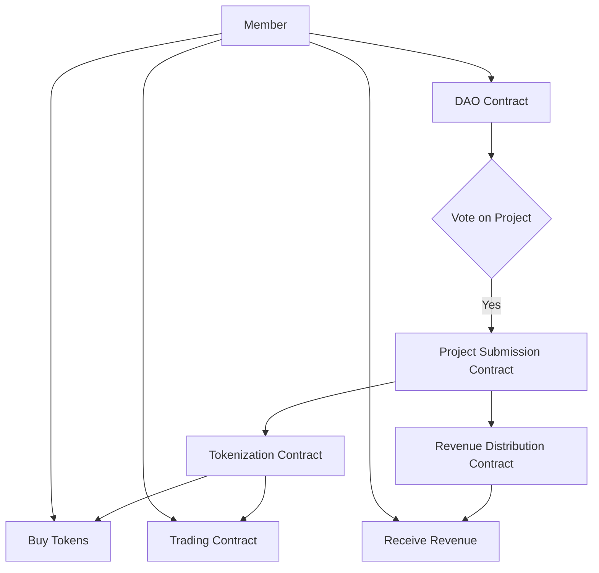

# InfraDAO
Tokenization of Infrustructure Project and Funding

# InfraDAO
Tokenization of RWA's through Infrustructure Project and Funding

**InfraDAO** is an innovative solution to democratize infrastructure funding. Our Decentralized Autonomous Organization (DAO) harnesses blockchain technology to tokenize infrastructure development projects, both private and public. This enables a new generation of investors to partake in vital infrastructure development by purchasing tokens representing shares in these projects.

Once a project is submitted to InfraDAO, it undergoes a thorough community-led vetting process. If approved via a majority vote, the project is tokenized and the ERC20 tokens are put up for sale, thus raising capital for the project's development.

Investors aren't just buying tokens; they're buying into the future of infrastructure and the potential for solid returns. As a token holder, you can trade your tokens on the open market or hold onto them and receive revenue based on the project’s stipulations. For example, for a residential property development, you would receive a share of profits from the sale of the units upon project completion.

InfraDAO revolutionizes how infrastructure development is funded, fostering greater transparency, access, and community engagement. With InfraDAO, everyone can play a part in shaping our built environment, contributing to projects they believe in and sharing in their success.

## Table of Contents

- [InfraDAO](#infradao)
- [InfraDAO](#infradao-1)
  - [Table of Contents](#table-of-contents)
  - [Getting Started](#getting-started)
    - [Prerequisites](#prerequisites)
    - [Installing](#installing)
  - [Project Flow (Mermaid Diagram)](#project-flow-mermaid-diagram)
  - [Usage](#usage)
  - [Contributing](#contributing)
  - [License](#license)

## Getting Started

These instructions will help you set up InfraDAO on your local machine for development and testing purposes.

### Prerequisites

- Node.js

### Installing

1. Clone the repo: git clone https://github.com/IKalonji/InfraDAO.git
2. Install NPM packages
3. Run NPM: npm run start

## Project Flow (Mermaid Diagram)

In this diagram:

* Members interact with the DAO Contract to vote on projects.
* If a project is approved, it goes through the Project Submission Contract and then to the Tokenization Contract.
* Members can then buy tokens directly or trade them through the Trading Contract.
* Finally, the Revenue Distribution Contract allows members to receive their share of the project's revenue.

## Usage

Contracts deployed on BNB Chain at the following addresses:

- DAO 0xdAdA29151A85b4926f7a78CbF768fc1F498b552e
- DEX 0x24224789aF593037EbCE1F4dE5B4F0B4Fc86cF66
- Project Submission 0xBde7A4Dc4Fd28729B668EC6361B8d5E7c82E462c
- Tokenization 0x253e8f14846e414354e7EB51F83BD4f7eaf522c5
- Revenue Distribution 0x6d69Bc7fa82A51b36a3A7e74781694122d192923

## Contributing

Contributions are what make the open-source community such an amazing place to learn, inspire, and create. Any contributions you make are greatly appreciated.

1. Fork the Project
2. Create your Feature Branch (`git checkout -b feature/AmazingFeature`)
3. Commit your Changes (`git commit -m 'Add some AmazingFeature'`)
4. Push to the Branch (`git push origin feature/AmazingFeature`)
5. Open a Pull Request

## License

Distributed under the MIT License.

